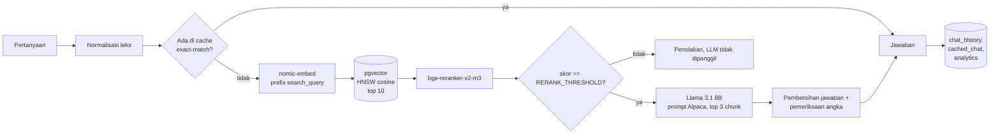

# RAG Service dengan FastAPI dan pgvector

[English](README.md)

API customer service berbasis RAG untuk perusahaan alat tulis kantor fiktif, dibangun sepenuhnya dengan model open source. Dokumen disimpan di PostgreSQL dengan pgvector, kandidat hasil pencarian dinilai ulang oleh reranker cross-encoder, jawaban ditulis oleh Llama 3.1 8B yang di-fine-tune untuk bahasa Indonesia, dan setiap jawaban melewati guardrail sebelum dikirim atau di-cache. Like, dislike, dan regenerate disimpan lalu ditampilkan di dashboard sederhana.

## Arsitektur



## Endpoint

| Endpoint | Fungsi |
|---|---|
| `POST /add_knowledge` | Unggah TXT atau PDF, di-chunk, lalu embedding-nya disimpan. Butuh header `X-API-Key`. |
| `GET /search` | Tampilan debug: skor cosine dan skor reranker untuk sebuah query, dipakai untuk kalibrasi threshold. |
| `POST /chat` | Menjawab pertanyaan. Diambil dari cache kalau pertanyaan yang sudah dinormalisasi pernah dijawab. |
| `POST /react` | Like atau dislike sebuah jawaban. Dislike menghapus jawaban itu dari cache. |
| `POST /regenerate` | Membuat jawaban baru (temperature 0,7) dan mengganti isi cache. |
| `GET /all-reactions` | Data reaksi untuk dashboard. |

## Hasil

Semua angka berasal dari notebook yang sudah dijalankan di GPU NVIDIA A100 40GB di Colab.

### Ingestion dan validasi

| Pengecekan | Hasil |
|---|---|
| Tiga teks FAQ | 200, masing-masing satu chunk |
| `document_id` yang sama diunggah lagi | **409** `document_id 'faq_produk' sudah ada.` |
| Unggah tanpa API key | **401** `API key tidak valid.` |
| Katalog PDF | 200, 13 chunk |
| Reaksi untuk `chat_history_id` yang tidak ada | **404** |

### Cosine similarity tidak bisa memisahkan pertanyaan relevan dan tidak relevan


Pada sembilan pertanyaan kalibrasi yang sama, skor cosine relevan terendah (0,6967) justru lebih rendah dari skor tidak relevan tertinggi (0,7149), jadi tidak ada threshold cosine yang berhasil. Reranker menyisakan celah yang jelas: 0,0229 untuk pertanyaan relevan terendah dan 0,0006 untuk pertanyaan tidak relevan tertinggi. `RERANK_THRESHOLD` diset ke 0,01.

### Penolakan disebabkan prompt, bukan retrieval


Dengan konteks hasil retrieval yang sama persis, prompt yang memberi model kalimat penolakan siap pakai membuat model menolak tiga dari empat pertanyaan yang sebenarnya bisa dijawab. Setelah pertanyaan dipindah ke slot `Instruction` pada format Alpaca dan keputusan menolak diserahkan ke reranker, jumlah penolakan turun menjadi nol.

### Chat

| Pertanyaan | Jawaban (diringkas) | Latensi |
|---|---|---|
| Berapa lama garansi produk? | 1 tahun sejak pembelian, klaim lewat aplikasi atau toko resmi | 0,60 dtk |
| Bagaimana cara retur barang? | Batas waktu retur dan keempat langkah dari katalog | 2,17 dtk |
| Berapa harga kertas HVS A4 80 gsm? | Rp56.000 per rim | 0,44 dtk |
| Ada tinta printer apa saja? | Tiga produk tinta dan toner | 1,97 dtk |
| Apakah dapat diskon kalau beli 30 unit? | Diskon 10% untuk pembelian lebih dari 20 unit | 0,38 dtk |
| Apa itu RAG dan bagaimana cara kerjanya? | Ditolak, LLM tidak dipanggil | 0,13 dtk |
| Berapa harga saham Tesla hari ini? | Ditolak, LLM tidak dipanggil | 0,13 dtk |
| Pertanyaan garansi yang sama, beda huruf besar dan spasi | Diambil dari cache | 0,02 dtk |

Setelah jawaban garansi di cache diberi dislike, permintaan berikutnya dibuat ulang (tidak diambil dari cache), lalu `/regenerate` mengganti isi cache.

### Dashboard reaksi


Hari tanpa reaksi diisi nol, supaya grafik tidak menarik garis melintasi hari yang kosong. Versi Streamlit-nya ada di `st_app.py`.

## Guardrail

- **Keputusan menolak diambil reranker.** Pertanyaan dengan skor di bawah `RERANK_THRESHOLD` langsung mendapat kalimat penolakan tanpa memanggil LLM.
- **Pembersihan jawaban.** Salinan pertanyaan di awal jawaban, kalimat yang berulang, dan kalimat terakhir yang terpotong oleh `max_tokens` dibuang. `repeat_penalty=1.15` mencegah model mengulang-ulang kalimat.
- **Pemeriksaan angka.** Kalau jawaban memuat angka (harga, durasi, jumlah) yang tidak ada di konteks, jawaban diganti dengan kalimat penolakan dan tidak di-cache.
- **Kebersihan cache.** Hanya jawaban substantif yang masuk cache. Penolakan, jawaban kosong, dan jawaban yang hanya mengulang pertanyaan tidak di-cache.

## Keterbatasan

- Model kadang menambahkan informasi yang tidak ditanyakan: jawaban retur ikut menyebut garansi, dan jawaban tinta ikut mendaftar produk lain.
- `repeat_penalty` mencegah jawaban berulang, tapi bisa memicu salah ketik kecil pada kata yang sering muncul (misalnya "retun" untuk "retur").
- Pemeriksaan angka hanya memastikan angka itu *ada* di konteks, bukan apakah angka itu dipakai dengan benar.
- Threshold reranker dikalibrasi dari sembilan pertanyaan. Pertanyaan diskon (0,0229) hanya sedikit di atas 0,01, jadi versi pertanyaan dengan kata-kata berbeda bisa tertolak.
- Pada temperature 0 pun, prompt yang sama bisa menghasilkan jawaban berbeda antar-panggilan di GPU.
- Cache hanya exact-match setelah normalisasi huruf dan spasi, jadi pertanyaan yang diparafrasekan tidak kena cache.
- Hanya `/add_knowledge` yang dilindungi. Endpoint lainnya dan instance PostgreSQL di dalam Colab (password `postgres`, hilang saat runtime mati) hanya untuk latihan, bukan konfigurasi produksi.

## Cara menjalankan

**Di Colab:** buka `rag_service_fastapi_pgvector.ipynb` dengan runtime GPU, lalu jalankan dari atas ke bawah. Notebook ini menginstal PostgreSQL dan mem-build pgvector di dalam runtime, lalu menguji API dengan `TestClient` FastAPI. Unggah `data/katalog_produk_emerald.pdf` saat diminta, lalu isi `RERANK_THRESHOLD` dari tabel kalibrasi.

**Di lokal** (butuh PostgreSQL dengan ekstensi pgvector):

```bash
pip install -r requirements.txt
export DB_PASSWORD=...          # ditambah DB_NAME, DB_USER, DB_HOST, DB_PORT bila perlu
export ADMIN_API_KEY=...        # wajib untuk /add_knowledge
export RERANK_THRESHOLD=0.01
python init_db.py
uvicorn app:app --port 8000
streamlit run st_app.py         # di terminal lain
```

Untuk inferensi di GPU, instal `llama-cpp-python` dengan `CMAKE_ARGS="-DGGML_CUDA=on"`.

## File

| File | Isi |
|---|---|
| `rag_service_fastapi_pgvector.ipynb` | Run lengkap di Colab, beserta output |
| `app.py` | Aplikasi FastAPI |
| `init_db.py` | Membuat database, tabel, dan index HNSW |
| `config.py` | Pengaturan database dari environment variable |
| `st_app.py` | Dashboard reaksi dengan Streamlit |
| `data/katalog_produk_emerald.pdf` | Katalog produk sintetis |

## Data

- Tiga teks FAQ singkat (garansi, retur, pengiriman) yang ditulis langsung di notebook.
- `data/katalog_produk_emerald.pdf`: katalog sintetis untuk perusahaan fiktif, dibuat khusus untuk proyek ini, berisi 17 produk kantor dan satu halaman ketentuan pembelian termasuk prosedur retur. Produk dan harganya tidak nyata.

## Teknologi

FastAPI · PostgreSQL 16 + pgvector 0.8.0 · llama-cpp-python (CUDA) · Llama 3.1 8B fine-tune bahasa Indonesia (GGUF) · nomic-embed-text-v1.5 · bge-reranker-v2-m3 · sentence-transformers · Streamlit · Google Colab

## Lisensi

[MIT](LICENSE)
