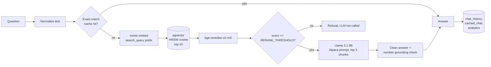
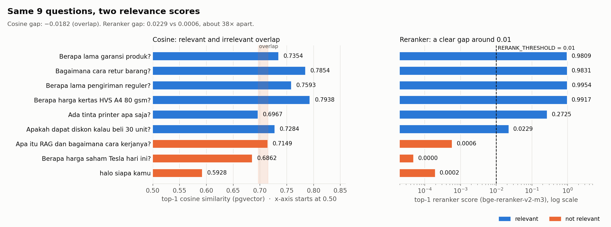
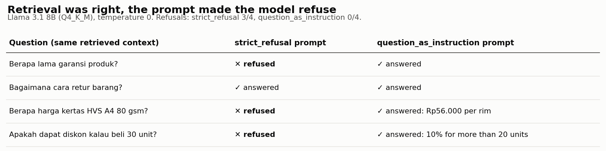
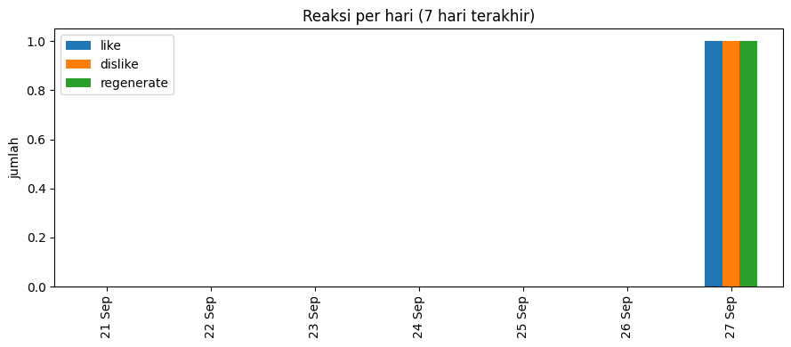

# RAG Service with FastAPI and pgvector

[Bahasa Indonesia](README.id.md)

A customer service RAG API for a fictional office supply company, built on open-source models only. Documents go into PostgreSQL with pgvector, candidates are re-scored by a cross-encoder reranker, a fine-tuned Indonesian Llama 3.1 8B writes the answer, and every answer passes through guardrails before it is sent or cached. Likes, dislikes and regenerations are stored and shown on a small dashboard.

## Architecture



## Endpoints

| Endpoint | Purpose |
|---|---|
| `POST /add_knowledge` | Upload a TXT or PDF, chunk it and store the embeddings. Requires the `X-API-Key` header. |
| `GET /search` | Debug view: cosine and reranker scores for a query, used to calibrate the threshold. |
| `POST /chat` | Answer a question. Served from the cache when the normalized question was answered before. |
| `POST /react` | Like or dislike an answer. A dislike removes that answer from the cache. |
| `POST /regenerate` | Generate a new answer (temperature 0.7) and replace the cached one. |
| `GET /all-reactions` | Reaction data for the dashboard. |

## Results

All numbers come from the executed notebook, run on a Colab NVIDIA A100 40GB GPU.

### Ingestion and validation

| Check | Result |
|---|---|
| Three FAQ texts | 200, one chunk each |
| Same `document_id` again | **409** `document_id 'faq_produk' sudah ada.` |
| Upload without API key | **401** `API key tidak valid.` |
| PDF catalog | 200, 13 chunks |
| Reaction for an unknown `chat_history_id` | **404** |

### Cosine similarity cannot separate relevant from irrelevant here



On the same nine calibration questions, the lowest relevant cosine score (0.6967) is lower than the highest irrelevant one (0.7149), so no cosine threshold works. The reranker leaves a clear gap: 0.0229 for the lowest relevant question against 0.0006 for the highest irrelevant one. `RERANK_THRESHOLD` is set to 0.01.

### The prompt, not retrieval, caused the refusals



With identical retrieved context, a prompt that gave the model a fixed refusal sentence to use made it refuse three of four answerable questions. Moving the question into the Alpaca `Instruction` slot and leaving the refusal decision to the reranker brought that to zero.

### Chat

| Question | Answer (shortened) | Latency |
|---|---|---|
| Berapa lama garansi produk? | 1 year from purchase, claim via app or official store | 0.60 s |
| Bagaimana cara retur barang? | Return window and all four steps from the catalog | 2.17 s |
| Berapa harga kertas HVS A4 80 gsm? | Rp56.000 per rim | 0.44 s |
| Ada tinta printer apa saja? | The three ink and toner products | 1.97 s |
| Apakah dapat diskon kalau beli 30 unit? | 10% discount for more than 20 units | 0.38 s |
| Apa itu RAG dan bagaimana cara kerjanya? | Refused, LLM not called | 0.13 s |
| Berapa harga saham Tesla hari ini? | Refused, LLM not called | 0.13 s |
| Same garansi question, different casing and spacing | Served from cache | 0.02 s |

After a dislike on the cached garansi answer, the next request was generated again (not served from cache), and `/regenerate` replaced the cache entry.

### Reaction dashboard



Days without reactions are filled with zero, so the chart does not draw a line across empty days. The Streamlit version is in `st_app.py`.

## Guardrails

- **Refusal is decided by the reranker.** Questions below `RERANK_THRESHOLD` get a fixed refusal without calling the LLM.
- **Answer cleaning.** A copy of the question at the start of an answer, repeated sentences, and a sentence cut off by `max_tokens` are removed. `repeat_penalty=1.15` keeps the model from looping.
- **Number grounding.** If an answer contains a number (price, duration, quantity) that does not appear in the retrieved context, it is replaced with the refusal and not cached.
- **Cache hygiene.** Only substantive answers are cached. Refusals, empty answers and answers that only repeat the question are not.

## Limitations

- The model sometimes adds information nobody asked for: the return answer also mentions the warranty, and the ink answer lists other products.
- `repeat_penalty` prevents loops but can cause small typos on frequent words (for example "retun" instead of "retur").
- The number check only verifies that a number *appears* in the context, not that it is used correctly.
- The reranker threshold was calibrated on nine questions. The discount question (0.0229) sits only just above 0.01, so a differently worded version could be rejected.
- Even at temperature 0, the same prompt can produce different answers between calls on the GPU.
- The cache is exact-match after lowercasing and whitespace normalization; paraphrased questions miss it.
- Only `/add_knowledge` is protected. The other endpoints, and the PostgreSQL instance inside Colab (password `postgres`, gone when the runtime stops), are for practice, not production.

## Run it

**In Colab:** open `rag_service_fastapi_pgvector.ipynb` with a GPU runtime and run it top to bottom. It installs PostgreSQL and builds pgvector inside the runtime, and tests the API with FastAPI's `TestClient`. Upload `data/katalog_produk_emerald.pdf` when asked, then fill in `RERANK_THRESHOLD` from the calibration table.

**Locally** (PostgreSQL with the pgvector extension required):

```bash
pip install -r requirements.txt
export DB_PASSWORD=...          # plus DB_NAME, DB_USER, DB_HOST, DB_PORT if needed
export ADMIN_API_KEY=...        # required for /add_knowledge
export RERANK_THRESHOLD=0.01
python init_db.py
uvicorn app:app --port 8000
streamlit run st_app.py         # in another terminal
```

For GPU inference, install `llama-cpp-python` with `CMAKE_ARGS="-DGGML_CUDA=on"`.

## Files

| File | Contents |
|---|---|
| `rag_service_fastapi_pgvector.ipynb` | Full run in Colab, with outputs |
| `app.py` | FastAPI application |
| `init_db.py` | Creates the database, tables and HNSW index |
| `config.py` | Database settings from environment variables |
| `st_app.py` | Streamlit reaction dashboard |
| `data/katalog_produk_emerald.pdf` | Synthetic product catalog |

## Data

- Three short FAQ texts (warranty, returns, shipping), written inline in the notebook.
- `data/katalog_produk_emerald.pdf`: a synthetic catalog for a fictional company, created for this project, with 17 office products and a page of purchase terms including the return procedure. Products and prices are not real.

## Tech stack

FastAPI · PostgreSQL 16 + pgvector 0.8.0 · llama-cpp-python (CUDA) · Llama 3.1 8B fine-tuned for Indonesian (GGUF) · nomic-embed-text-v1.5 · bge-reranker-v2-m3 · sentence-transformers · Streamlit · Google Colab

## License

[MIT](LICENSE)
